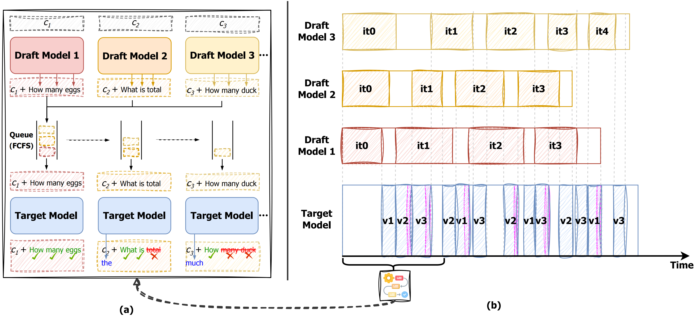

# SEED: Accelerating Reasoning Tree Construction via Scheduled Speculative Decoding
[](https://arxiv.org/abs/2406.18200)

## Overview
We introduce SeeD, a novel and efficient inference framework to optimize runtime speed and GPU memory management concurrently. By employing a scheduled speculative execution, SeeD efficiently handles multiple iterations for the thought generation and the state evaluation, leveraging a rounds-scheduled strategy to manage draft model dispatching.

<div style="text-align: center;">
    
</div>


## Environment Setup
```
transformers >= 4.35.0
Python version >= 3.9
PyTorch version >= 1.11.0
```

## Quick Start (One Command)
```
python src/run_example.py
```

**Key Options**
```
--draft_model_path          Draft model path.
--target_model_path         Target model path.
--tokenizer_path            Tokenizer path. If not provided, use the Draft/Target model path.
--num_thoughts              the num of draft models/ToT thoughts
--muti_candidate            use muti-candidate sd.
--k-config                  Use comma separations, e.g. `--k-config 2,1,1`.
--replacement               Sampling with replacement.(Flase-MCSD, True-SD)
--temperature               0.0, 0.2, 1.0, ...
```


## TODO
#### The code is still being organized.🚧
- [x] Provide a simplified version to help understand the core principle, with the goal of transitioning to general tasks. (In this version, the Tree of Thoughts (ToT) has a single root node, with a depth of 2, generating 3 thoughts and 3 evaluations at once. Draft model-**[LLAMA-68M-Chat](https://huggingface.co/Felladrin/Llama-68M-Chat-v1)**, Target model-**[LLAMA2-7b-chat](https://huggingface.co/meta-llama/Llama-2-7b-chat-hf)**)
- [ ] reorgnize the code for better using experience
- [ ] support other models


## Citation

#### If you find our work valuable, we would appreciate your citation: 🎈
```bibtex
@article{wang2024seed,
  title={SEED: Accelerating Reasoning Tree Construction via Scheduled Speculative Decoding},
  author={Wang, Zhenglin and Wu, Jialong and Lai, Yilong and Zhang, Congzhi and Zhou, Deyu},
  journal={arXiv preprint arXiv:2406.18200},
  year={2024}
}
```


## Acknowledgements

Thanks to **[MCSD](https://github.com/NJUNLP/MCSD)** for providing open-source code that supported the expansion of this project.

Thanks to **[ToT](https://github.com/princeton-nlp/tree-of-thought-llm)** for providing open-source code that supported the expansion of this project.

Also, thanks to the open-source implementation from **[Tree of Thoughts](https://github.com/kyegomez/tree-of-thoughts)**.
